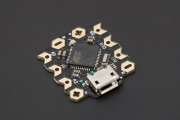
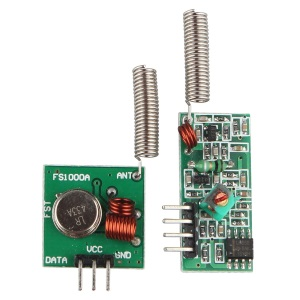
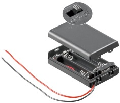

Detecteur de débordemnet
===================

Bonjour, Ceci est un petit capteur RF de débordement à base d’arduino .

Contexte du projet
-------------

Avoir une sonde permettant de vérifier qu'il n'y a pas de fuite d'eau ou de debordement. 

Je vis en immeuble et plusieurs voisin ont déjà eu des débordement de lave vaisselle, lave linge ou autre. 

Ayant déjà une solution domotique basée sur un RFXcom et domoticz, j'ai souhaité faire une petite sonde pas trop cher qui permette de remonter l'information à la centrale domotique qui enverra alors une alerte si le capteur détecte une inondation.

Présentation 
------------

 - 1 x Arduino Beetle de chez DF Robot car elle est vraiement mini mini
 - 1 x coupleur 3 piles AAA avec interrupteur
 - 1 x un emmeteur RF 433 MHz

