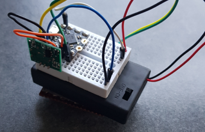
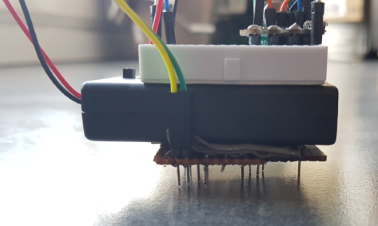
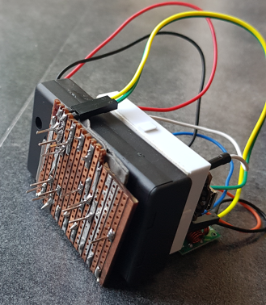

Detecteur de débordemnet
===================

Bonjour, Ceci est un petit capteur RF de débordement à base d’arduino .

Contexte du projet
-------------

Avoir une sonde permettant de vérifier qu'il n'y a pas de fuite d'eau ou de debordement. 

Je vis en immeuble et plusieurs voisin ont déjà eu des débordement de lave vaisselle, lave linge ou autre. 

Ayant déjà une solution domotique basée sur un RFXcom et domoticz, j'ai souhaité faire une petite sonde pas trop cher qui permette de remonter l'information à la centrale domotique qui enverra alors une alerte si le capteur détecte une inondation.

Présentation 
------------

 - 1 x Arduino Beetle de chez DF Robot car elle est vraiement mini mini
 - 1 x coupleur 3 piles AAA avec interrupteur
 - 1 x un emmeteur RF 433 MHz

Principe de fonctionnement
--------------------------

La détection se fait de manière très simple, on utilise une entrée digitale en mode INPUT_PULLUP.
Quand de l'eau entre en contact entre la broche d'entrée digitale et la broche de masse, l'état de la pin digitale passe de 1 à 0.
Afin de detecter de façon fiable l'eau d'un éventuel débordement, la distance entre les broches est volontairement faible.
Une plaque de bakélite a été utilisée et des broches on été soudées entre autre aux extrémités de la platine afin de faire une base stable au montage.

Le but étant que le capteur doit être économe en énergie, le programme utilise la fonction de deep sleep de l'arduino.
Autre point d'économie d'énergie, le capteur allume le transmetteur sans fil uniquement dans les 2 cas suivants :

- Cas 1 : 5 minutes se sont écoulées depuis la dernière notification
- Cas 2 : le capteur a détecté une innondation.

